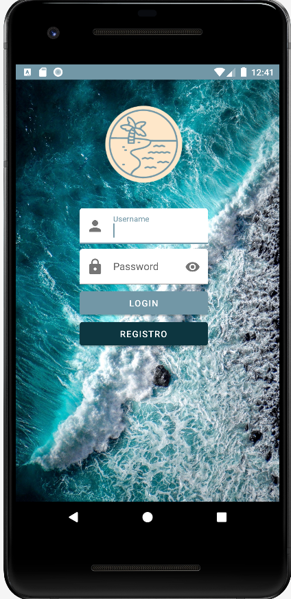

# *Delightful by ASIER ARANDA*

## 1. SplashScreen

* Para comenzar mi aplicación voy a mostrar mi SplashScreen.
* He intentado que las animaciones simulen el oleaje
  * Logo: tiene un parpadeo con alpha, haciendolo menos visible a más visible.
  * Título: tiene un pequeño shake lateral como si la ola le golpease.
  * Nombre Desarrollador: aparece desde abajo para que quede en segundo plano a primera vista al abrir la App.

* Como se puede observar en la siguiente imagen, he diseñado mi App basandose en una paleta de colores basandose en el background como muestro a continuación.

* Para el titulo de mi aplicación he usado una sombra para resaltar dicho titulo con una fuente Bromello y coloreando el titulo basandome también en la paleta de colores.

## 2. Login
* al pasar 3000 milisegundos se accede automaticamente a la activity "Login".

