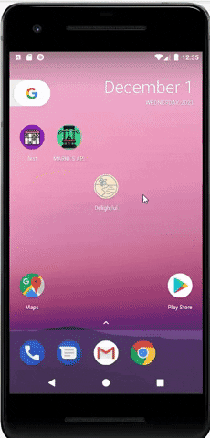
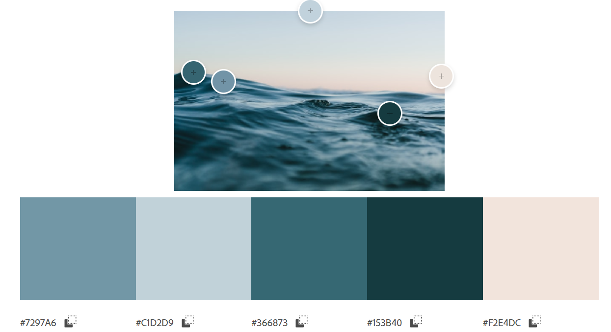
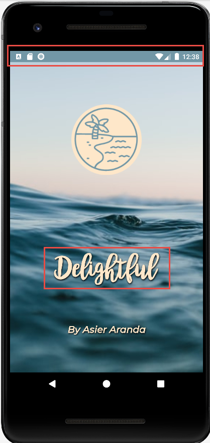
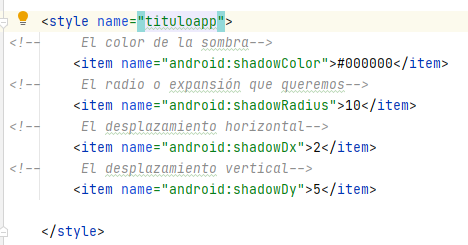
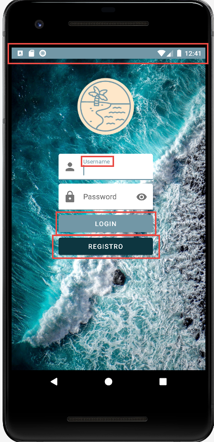
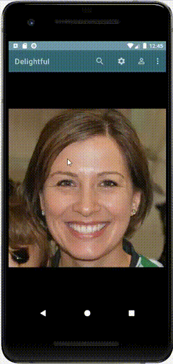
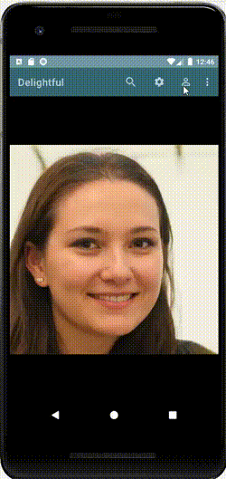
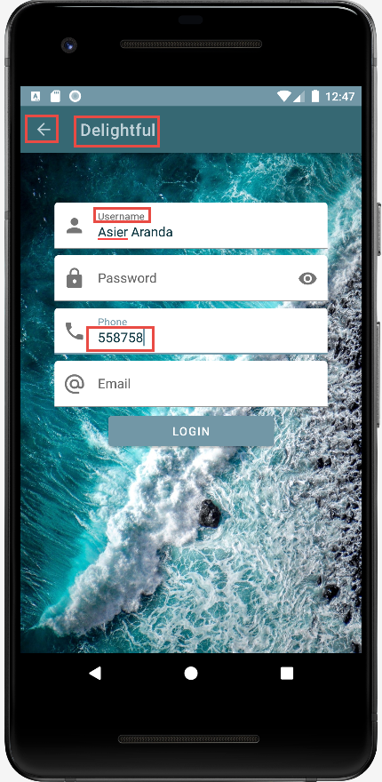
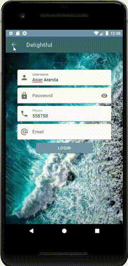

# *Delightful by ASIER ARANDA*

## 1. SplashScreen

* Para comenzar mi aplicación voy a mostrar mi SplashScreen.
* He intentado que las animaciones simulen el oleaje
  * Logo: tiene un parpadeo con alpha, haciendolo menos visible a más visible.
  * Título: tiene un pequeño shake lateral como si la ola le golpease.
  * Nombre Desarrollador: aparece desde abajo para que quede en segundo plano a primera vista al abrir la App.

* Como se puede observar en la siguiente imagen, he diseñado mi App basandose en una paleta de colores basandose en el background como muestro a continuación.

* Para el titulo de mi aplicación he usado una sombra para resaltar dicho titulo con una fuente Bromello y coloreando el titulo basandome también en la paleta de colores.

## 2. Login
* Al pasar 3000 milisegundos se accede automaticamente a la activity "Login".
* Podemos observar que la "status bar" es de un color clarito que seguirá en toda nuestra app.
* También he modificado el color de los hint y unos botones siguiendo el patrón de colores.
* El fondo de este Activity es distinto al del *SplashScreen* pero tienen colores similares para tener una armonia.
* Ambos botones al pulsarse llevarán a otro activity.

## 3.Main
* Hacemos click en login e interactuamos con los iconos de la activity "Main".

* Después de ver los mensajes emergentes de cada icono vamos a darle al icono de "USER".
* Nos desplegará un menú en el cual podremos interactuar.

## 4.Registro
* Al haber dado a "SignUp" como se ve en el Gif te redirecciona a mi activity "SignUp".
* Como comenté antes modificando los "themes" he logrado utilizar todos los colores de la paleta y adaptarlos.
* He puesto una flecha para volver a atrás.

* Y aquí vemos como salir de la App

